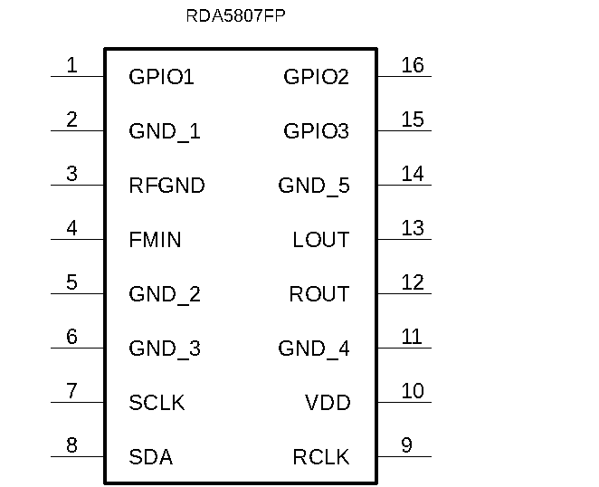
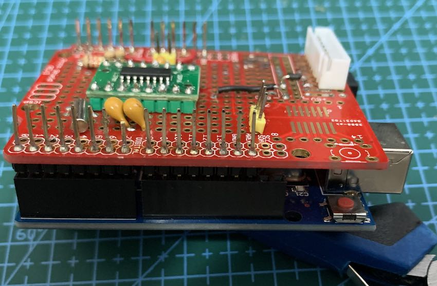
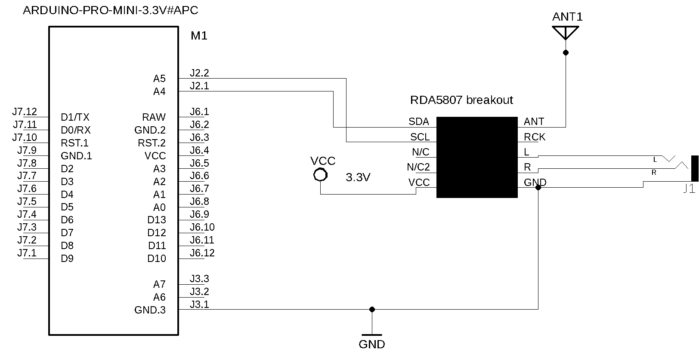
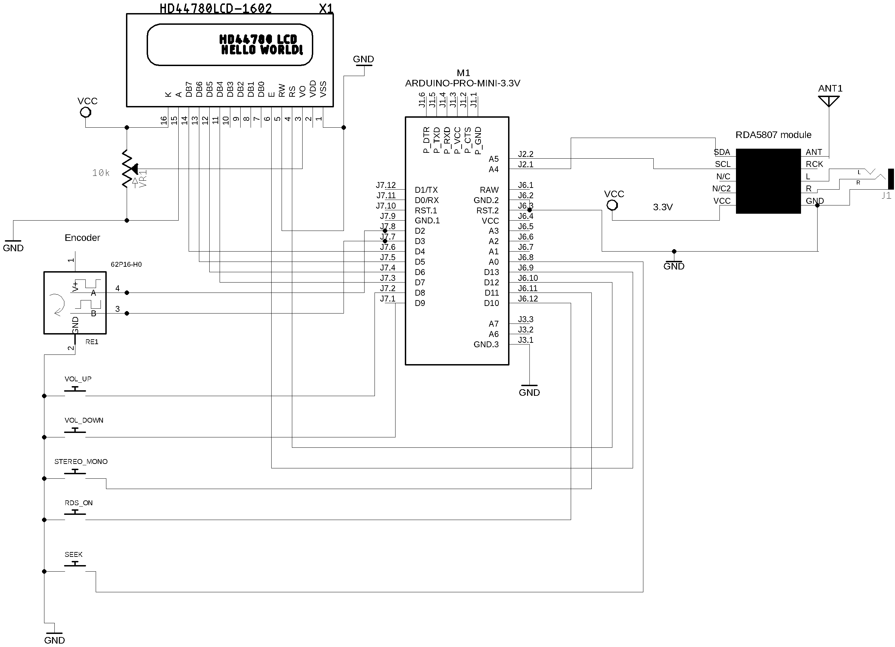

# [RDA5807 Arduino Library](https://pu2clr.github.io/RDA5807/)

It is a cross-platform Arduino Library for RDA5807 family device from RDA. You can use it with official Arduino boards, ATtiny, STM32 , ESP32 and more. It works with I2C protocol and can provide you an easier interface to control the RDA5807 device. This library was built based on "RDA microelectronics RDA5807M - SINGLE-CHIP BROADCAST FM RADIO TUNER - Rev.1.1–Aug.2015" and RDA microelectronics RDA5807FP - SINGLE-CHIP BROADCAST FM RADIO TUNER

This library can be freely distributed using the MIT Free Software model. 


[Copyright (c) 2019 Ricardo Lima Caratti](https://pu2clr.github.io/RDA5807/#mit-license). 

Contact: __pu2clr@gmail.com__.


## Contents

1. [Preface](https://pu2clr.github.io/RDA5807#preface)
2. [RDA5807 family devices and RDA5807 Arduino Library](https://pu2clr.github.io/RDA5807#rda5807-family-devices-and-rda5807-arduino-library)
2. [Library Installation](https://pu2clr.github.io/RDA5807#library-installation)
3. [API Documentation](https://pu2clr.github.io/RDA5807/extras/apidoc/html)
4. [Basic Schematic](https://pu2clr.github.io/RDA5807#schematic)
5. [All Schematics](extras/)
5. [Source code - Arduino Sketches](https://github.com/pu2clr/RDA5807/tree/master/examples)


## Attention
* __The RDA5807 device can work safaty from 2.7 to 3.3V. Be aware that some Arduino board oparates with 5V instead of 3.3V (for example: Arduino Uno and Arduino Nano). A wrong setup can make the system unstable or damage the RDA5807 device__. Preferably use an Arduino or other boards like ESP32 and  ESP8266 that work with 3.3V voltage. If you are not using a 3.3V version of board, you must use a kind of 5V to 3.3V converter to feed the RDA5807 device and to send signal to  SCLK and SDIO/SDA pins.  In my experiments, I used an Arduino Nano (5V) and fed the RDA5807 with 3.3V (from the Nano. See the Pin 3.3V of the Arduino). It has worked. However, this is at your own risk.
 

## Preface 

The RDA5807 is a FM DSP integrated circuit receiver (50 to 115MHz) with low noise amplifier support. This device requires very few external components if compared with other similar devices. It also supports RDS/RBDS functionalities, direct auto gain control (AGC) and real time adaptive noise cancellation function. The PU2CLR RDA5807 Arduino Library was developed to take the most functionalities of this device. Plese, check the [API Documentation](https://pu2clr.github.io/RDA5807/extras/apidoc/html/) for more details. 


## RDA5807 family devices and RDA5807 Arduino Library

This library has been successfully tested on RDA5807M and RDA5807FP devices. The videos below show some examples of using this library with RDA5807M and RDA5807FP.  




* [See the presentation video on youtube](https://youtu.be/eLWEWEjxM8U) 




* [See RDS and TFT Display example - youtube](https://youtu.be/PZsbqieeYns) 




* [See RDS and Nokia 5110 Display example - youtube](https://youtu.be/jInacTWoF9Y) 


## RDA5807 features implemented by this library

1. 76–108 MHz
2. Seek tuning
3. Automatic frequency control (AFC)
4. Automatic gain control (AGC)
5. Programmable de-emphasis (50/75 μs)
6. Adaptive noise suppression
7. Volume control
8. Mute control
9. Mono/Stereo control
10. RDS/RBDS Processor (under construction)
11. I2S Digital Audio (RDA5807FP)


You can buy the RDA5807 device on AliExpress, eBay, Amazon etc. You will find two types of RDA5807: The RDA5807MS (breakout) and RDA5807FP (standalone IC).  


## Library Installation

 The easiest method to install this library is via your Arduino IDE. All you have to do is:
 
 1. Select Tools menu;
 2. Select Manage Libraries option;
 3. In the text box (top windows), type PU2CLR or RDA5807;
 4. Select the PU2CLR RDA5807. 


The images below show how you can install this library via your Arduino IDE from Manage Libraries tool.

<BR>


<BR>


### Installing via the repository 

With this approach, you will have the __most current version__ of the library. However, __it may not be the most stable version__. This is because the current version is always in development. [Prefer releases](https://github.com/pu2clr/RDA5807/releases). Do you need some old version (release) of this library?  If yes, [check here](https://github.com/pu2clr/RDA5807/releases).


First, you have to [download](https://github.com/pu2clr/RDA5807/archive/master.zip) this library in zip format.  
After, unzip the RDA5807-master.zip file in your Arduino Library folder. 

* On __Windows__: "My Documents\Arduino\libraries"
* On __MAC OS__: ˜/Documents/Arduino/libraries
* On __Linux__: ˜/home/Arduino/libraries


### Installing the most current version via arduino-cli

The commands below Install the latest version of the PU2CLR RDA5807 Arduino Library from github. 
As said before, unlike a release (installed from Arduino IDE) this method installs the current version of the PU2CLR RDA5807 Arduino Library (latest modifications even if not yet released).


#### On macOS or Linux

```bash
curl -fsSL https://raw.githubusercontent.com/arduino/arduino-cli/master/install.sh | sh
export ARDUINO_LIBRARY_ENABLE_UNSAFE_INSTALL=true
./bin/arduino-cli lib install --git-url https://github.com/pu2clr/RDA5807
```

#### On Windows 10 or 11

Run the command shell (cmd / Command Prompt) and follow the steps below.

```bash
echo off  
curl -fsSL https://downloads.arduino.cc/arduino-cli/arduino-cli_latest_Windows_64bit.zip --output arduinocli.zip
tar -xf arduinocli.zip 
set ARDUINO_LIBRARY_ENABLE_UNSAFE_INSTALL=true
.\arduino-cli lib install --git-url https://github.com/pu2clr/RDA5807
```

<BR>

### RDA5807MS breakout

The photo below shows a Breakout that uses the RDA5807MS. 


<BR>

### RDA5807FP standalone IC

If you are using the standalone RDA5807FP you must add some parts to make it work.  In my opinion, there is no big  reasons to use the RDA5807FP instead of the RDA5807MS breakout. I think the most important thing is the possibility to use the digital audio configuration via I2S protocol. This library has function to deal with I2S.


### RDA5807FP PINOUT


 





|  PIN     |  Label    |  Description      |
| -------- | --------- | ----------------- |
|    1     |  GPIO1    | General purpose input/output (Stereo indicator, interrupt etc) | 
|    2     |  GND_1    | Ground. Must be connected to ground |
|    3     |  RFGND    | RF Ground. Must be connected to the ground or a special RF ground |
|    4     |  FMIN     | FM signal imput - Antenna |
|    5     |  GND_2    | Ground. Must be connected to ground | 
|    6     |  GND_3    | Ground. Must be connected to ground |
|    7     |  SCLK     | I2C clock | 
|    8     |  SDA      | I2C SDA/SDIO |
|    9     |  RCLK     | 32.768kHz pasive crystal | 
|   10     |  VDD      | 3.3V power supply |
|   11     |  GND_4    | Ground. Must be connected to ground |
|   12     |  ROUT     | Right audio output |
|   13     |  LOUT     | Left audio output |
|   14     |  GND_5    | Ground. Must be connected to ground |
|   15     |  GPIO3    | General purpose input/output  |
|   16     |  GPIO2    | General purpose input/output  |


The two photos below show the standalone RDA5807FP IC mounted on a homebrew board.


<BR>


<BR> 

The schematic below shows the basic RDA5807FP setup. 


| Components |  Value | 
| ---------- | ------ |
| R1         |  1K    |
| R2         |  1K    |
| R3         |  8 ~ 12K   |
| R4         |  8 ~ 12K   |
| C1         |  1nF  (FMIN) |
| C2 and C3  |  4,7 ~ 10uF tantalum capacitor (stereo audio output) |      
| Q1         |  32768 kHz passive crystal occilator |
| J1         |  Audio stereo jack |


### The RDA5807FP on an Arduino Uno adapter


The photos below show the RDA5807FP setup on a Arduino Uno board adapter.







* [See the presentation video on youtube](https://youtu.be/I7-fCKPDF4Y) 


<BR>


## MIT License 

Copyright (c) 2019 Ricardo Lima Caratti

Permission is hereby granted, free of charge, to any person obtaining a copy of this software and associated documentation files (the "Software"), to deal in the Software without restriction, including without limitation the rights to use, copy, modify, merge, publish, distribute, sublicense, and/or sell copies of the Software, and to permit persons to whom the Software is furnished to do so, subject to the following conditions:

The above copyright notice and this permission notice shall be included in all copies or substantial portions of the Software.

THE SOFTWARE IS PROVIDED "AS IS", WITHOUT WARRANTY OF ANY KIND, EXPRESS OR IMPLIED, INCLUDING BUT NOT LIMITED TO THE ARRANTIES OF MERCHANTABILITY, FITNESS FOR A PARTICULAR PURPOSE AND NONINFRINGEMENT. IN NO EVENT SHALL THE AUTHORS OR COPYRIGHT HOLDERS BE LIABLE FOR ANY CLAIM, DAMAGES OR OTHER LIABILITY, WHETHER IN AN ACTION OF CONTRACT, TORT OR OTHERWISE, ARISING FROM, OUT OF OR IN CONNECTION WITH THE SOFTWARE OR THE USE OR OTHER DEALINGS IN THE SOFTWARE.


<BR>

## Schematic

 In general, the RDA5807 can be found in kit or breakout form. In this case, the circuit below can help you to connect the arduino to the RDA5807 shield. If you are using just the IC, you might want to check the  [RDA5807M - SINGLE-CHIP BROADCAST FM RADIO TUNER - Rev.1.1–Aug.2015](https://datasheet.lcsc.com/szlcsc/RDA-Microelectronics-RDA5807MS_C167246.pdf); page 17.





### Wire up on Arduino UNO, Pro mini or other based on ATmega 328.

| RDA5807 / Description |  Arduino Pin  |
| --------------------- | ------------  |
| VCC                   |   3.3V        |
| SDA / SDIO            |     A4        |
| SCL / SCLK            |     A5        |


### Wire up on Arduino, TFT7735 display and Push Buttons.


#### Arduino UNO, Nano or other based on Atmega328 and SPI TFT ST7735 1.8" wireup


| Device name       | Device Pin / Description  |  Arduino Pin  |
| ----------------  | --------------------      | ------------  |
| Display TFT       |                           |               |
|                   | RST (RESET)               |      8        |
|                   | RS  or DC                 |      9        |
|                   | CS  or SS                 |     10        |
|                   | SDI                       |     11        |
|                   | CLK                       |     13        |
|     RDA5807       |                           |               |
|                   | VCC                       |     3.3V      | 
|                   | SDIO (pin 8)              |     A4        |
|                   | SCLK (pin 7)              |     A5        |
|     Buttons       |                           |               |
|                   | Volume Up                 |      4        |
|                   | Volume Down               |      5        |
|                   | Stereo/Mono               |      6        |
|                   | RDS ON/off                |      7        |
|                   | SEEK (encoder button)     |     A0/14     |
|    Encoder        |                           |               |
|                   | A                         |       2       |
|                   | B                         |       3       |


## RDA5807 breakout, ATtiny84, Encoder and Buttons schematic


### RDA5807 breakout, ATtiny84, Encoder and Buttons  wireup  

<BR>

| RDA5807 pin     | Attiny84 REF pin | Physical pin  | 
| ----------------| -----------------| ------------- | 
| SEEK_UP         |     3            |    10         | 
| SEEK_DOWN       |     5            |     8         |
| ENCODER_PIN_A   |     0            |    13         |
| ENCODER_PIN_B   |     1            |    12         |  
| SDIO / SDA      |     SDA          |     7         |
| SCLK / CLK      |     SCL          |     9         |


### RDA5807 breakout, Arduino Nano and Nokia 5110 display wireup


| Device name               | Nokia 5110                |  Arduino      |
| --------------------------| --------------------      | ------------  |
| NOKIA 5110                | Pin function              |  Nano Pin     |
|                           | (1) RST (RESET)           |     8         |
|                           | (2) CE or CS              |     9         |
|                           | (3) DC or DO              |    10         |
|                           | (4) DIN or DI or MOSI     |    11         |
|                           | (5) CLK                   |    13         |
|                           | (6) VCC  (3V-5V)          |    +VCC       |
|                           | (7) BL/DL/LIGHT           |    +VCC       |
|                           | (8) GND                   |    GND        |
| --------------------------| ------------------------- | --------------|
| RDA5807                   |       Pin Function        |               | 
|                           | VCC                       |   3.3V        | 
|                           | SDIO (pin 8)              |     A4        |
|                           | SCLK (pin 7)              |     A5        |
| --------------------------| --------------------------| --------------|
| Buttons                   |                           |               |
|                           | Volume Up                 |      4        |
|                           | Volume Down               |      5        |
|                           | Stereo/Mono               |      6        |
|                           | RDS ON/off                |      7        |
|                           | SEEK (encoder button)     |     A0/14     |
| --------------------------| --------------------------|---------------| 
| Encoder                   |                           |               |
|                           | A                         |       2       |
|                           | B                         |       3       |


<BR>

### Arduino Nano, RDA5807 and Nokia 5110 setup  on Breadboard


### RDA5807 breakout, Arduino Nano and LCD16X02 display wireup



<BR>


| Device name               | Device Pin / Description  |  Arduino Pin  |
| --------------------------| --------------------      | ------------  |
|    LCD 16x2 or 20x4       |                           |               |
|                           | D4                        |     D7        |
|                           | D5                        |     D6        |
|                           | D6                        |     D5        |
|                           | D7                        |     D4        |
|                           | RS                        |     D12       |
|                           | E/ENA                     |     D13       |
|                           | RW & VSS & K (16)         |    GND        |
|                           | A (15) & VDD              |    +Vcc       |
| --------------------------| ------------------------- | --------------|
| RDA5807                   |                           |               | 
|                           | VCC                       |   3.3V        | 
|                           | SDIO (pin 8)              |     A4        |
|                           | SCLK (pin 7)              |     A5        |
| --------------------------| --------------------------| --------------|
| Buttons                   |                           |               |
|                           | Volume Up                 |      8        |
|                           | Volume Down               |      9        |
|                           | Stereo/Mono               |     10        |
|                           | RDS ON/off                |     11        |
|                           | SEEK (encoder button)     |     D14/A0    |
| --------------------------| --------------------------|---------------| 
| Encoder                   |                           |               |
|                           | A                         |       2       |
|                           | B                         |       3       |


### RDA5807FP setup, ESP32 and LCD16X02 display wireup


<BR>

Wire up ESP32 Dev Module, RDA5807 and LCD16x02 or LCD16x04

| Device name               | Device Pin / Description  |  Arduino Pin  |
| --------------------------| --------------------      | ------------  |
|    LCD 16x2 or 20x4       |                           |               |
|                           | D4                        |  GPIO18       |
|                           | D5                        |  GPIO17       |
|                           | D6                        |  GPIO16       |
|                           | D7                        |  GPIO15       |
|                           | RS                        |  GPIO19       |
|                           | E/ENA                     |  GPIO23       |
|                           | RW & VSS & K (16)         |  GND          |
|                           | A (15) & VDD              |  +Vcc         |
| --------------------------| ------------------------- | --------------|
| RDA5807FP (See schematic) |                           |               | 
|                           | VCC                       |  3.3V         |
|                           | SDIO / SDA (pin 8)        |  GPIO21       |
|                           | SCLK (pin 7)              |  GPIO22       |
| Buttons                   |                           |               |
|                           | Volume Up                 |  GPIO32       |
|                           | Volume Down               |  GPIO33       |
|                           | Stereo/Mono               |  GPIO25       |
|                           | RDS On/Off                |  GPIO26       |
| --------------------------| --------------------------| --------------|
| Encoder                   |                           |               |
|                           | A                         |  GPIO13       |
|                           | B                         |  GPIO14       |
|                           | PUSH BUTTON (encoder)     |  GPIO27       |


ATTENTION: Be guided by the ESP32 IO/GPIO pins. 


# Thanks

* I would like to thanks to __Dimitri, F5SWB__, for sharing his project based on RDA5807 (RDA5807 fm chipset / arduino with a Nextion screen F5SWB@2021 / Version 1.18). See [RDA5807](https://github.com/f5swb/RDA5807) 


# TO DO

* RDS Improvments;
* Example using OLED;
* Check the functions/methods to deal with I2S (RDA5807FP);
* Fix the problem with 200 kHz frequency step


### See also

* [PU2CLR Si4735 Library for Arduino](https://pu2clr.github.io/SI4735/). This library was built based on “Si47XX PROGRAMMING GUIDE; AN332” and it has support to FM, AM and SSB modes (LW, MW and SW). It also can be used on all members of the SI47XX family respecting, of course, the features available for each IC version;
* [PU2CLR SI4844 Arduino Library](https://pu2clr.github.io/SI4844). This is an Arduino library for the SI4844, BROADCAST ANALOG TUNING DIGITAL * DISPLAY AM/FM/SW RADIO RECEIVER,  IC from Silicon Labs.  It is available on Arduino IDE. This library is intended to provide an easier interface for controlling the SI4844.
* [PU2CLR AKC695X Arduino Library](https://pu2clr.github.io/AKC695X/). The AKC695X is a family of IC DSP receiver from AKC technology. The AKC6955 and AKC6959sx support AM and FM modes. On AM mode the AKC6955 and AKC6959sx work on LW, MW and SW. On FM mode they work from 64MHz to 222MHz.
* [PU2CLR KT0915 Arduino Library](https://pu2clr.github.io/KT0915/). The KT0915 is a full band AM (LW, MW and SW) and FM DSP receiver that can provide you a easy way to build a high quality radio with low cost.
* [PU2CLR BK108X](https://pu2clr.github.io/BK108X/). The BK1086 and BK1088 are DSP receivers from BAKEN. The BK1088 is a BROADCAST FM and AM (LW, MW and ) RECEIVER and BK1086 is a subset of the BK1088 (it does not have LW and SW acording to the Datasheet).
* [PU2CLR RDA5807 Arduino Library](https://pu2clr.github.io/RDA5807/). The RDA5807 is a FM DSP integrated circuit receiver (50 to 115MHz) with low noise amplifier support. This device requires very few external components if compared with other similar devices. It also supports RDS/RBDS functionalities, direct auto gain control (AGC) and real time adaptive noise cancellation function.
* [PU2CLR SI470X Arduino Library](https://pu2clr.github.io/SI470X/). It is a Silicon Labs device family that integrates the complete functionalities for FM receivers, including RDS (Si4703).
* [PU2CLR MCP23008](https://pu2clr.github.io/MCP23008/). It is an Arduino Library to control the MCP23008/MCP23S08 8-Bit I/O Expander. The MCP23008 device provides 8-bit, general purpose, parallel I/O expansion. It can be controlled via I2C bus applications. It is a great and inexpensive device that allow you to add more devices to be controlled by your Arduino board via I2C protocol.
* [PU2CLR - PCF8574 Arduino Library](https://pu2clr.github.io/PCF8574/). It is an Arduino Library to control the PCF8574 8-Bit I/O Expander. The PCF8574 device provides 8-bit, general purpose, parallel I/O expansion. It can be controlled via I²C bus applications. It is a great and inexpensive device that allow you to add more peripherals to be controlled by your Arduino board via I²C protocol.

### More Arduino Projects developed by author 

* [Multipurpose signal generator with SI5351](https://pu2clr.github.io/SI5351/). It is a multipurpose signal generator controlled by Arduino. This project uses the SI5351 from Silicon Labs. The Arduino sketch is configured to control the SI5351 with three channels from 32.768KHz to 160MHz and steps from 1Hz to 1MHz.
* [Shortwave Arduino Transmitter](https://pu2clr.github.io/Small-Shortwave-Transmitter/). This project is about a shortwave transmitter from 3 MHz to 30 MHz. It uses the SI5351 oscillator from Silicon Labs controlled by Arduino. Also, you can use it with a crystal oscillator. In this case, you will not need the SI5351 device and Arduino. 
* [Android and iOS Bluetooth Remote Control for PU2CLR Arduino Library DSP receivers](https://pu2clr.github.io/bluetooth_remote_control/). This project is an extension of the Arduino library projects for: [SI4735](https://pu2clr.github.io/SI4735/); [AKC6959](https://pu2clr.github.io/AKC695X/) and [KT0915](https://pu2clr.github.io/KT0915/). It is a simple example that shows a way to use your smartphone as a remote control via Bluetooth. In order to follow the steps presented here, I am assuming that you have some knowledge in development for mobile devices. Also, you will need to be familiar with the Javascript programming language. The development environment used by this project is the [Apache Cordova](https://cordova.apache.org/docs/en/latest/guide/overview/index.html). Cordova is a open-source mobile development framework that allows you to develop cross-platform applications. That means you can code once and deploy the application in many system, including iOS and Android. 
Cordova provides an easy way to develop for iOS and Android.  
* [Band Pass Filter controlled by Arduino](https://pu2clr.github.io/auto_bpf_arduino/). It is a HF band pass filter controlled by Arduino. It is designed for HF receivers. With this project, you can use a set of up to four HF bandpass filters that can be selected by Arduino. To do that you will need just two digital Arduino pins.


# References 


* [Receptor de FM SDR con RDA5807 - Spanish](https://youtu.be/6PAnqT2TrL8)
* [RDA5807 Fm based radio - Portuguese](https://youtu.be/2g1KJkDFCaU)
* [Rádio FM RDA5807 com ESP32, Arduino etc - Portuguese](https://www.dobitaobyte.com.br/radio-fm-rda5807-com-esp32-arduino-etc/?amp)

* [RDA5807M - SINGLE-CHIP BROADCAST FMRADIO TUNER](https://www.electrodragon.com/w/images/5/5f/RDA5807M_datasheet_v1.pdf)
* [A small eagle library for popular RDA5807 Radio module](https://github.com/TigerBouli/RDA5807m-Module-)
* [RDA5807 fm chipset / arduino with a Nextion screen F5SWB@2021 / Version 1.18](https://github.com/f5swb/RDA5807)
  
* [Breadboard FM Radio with RDA5807 and WIO Terminal](https://youtu.be/ONZBhaCEMVM)
* [RDA5807 Real test demo](https://youtu.be/0PnV5YjpnV4)
* [Receptor FM RDA5807 y Arduin. de 50 a 115 Mhz Experimental](https://youtu.be/g7dwFqzRjV0)


