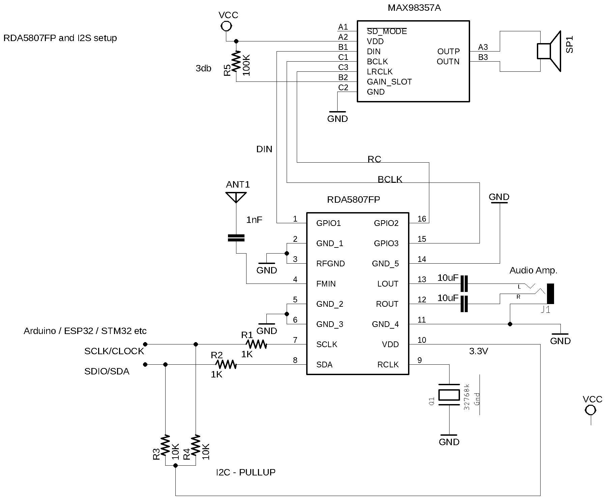

# Examples Folder

[This folder](https://github.com/pu2clr/RDA5807/tree/master/examples) has some examples that might help you to use the RDA5807 Arduino Library in your receiver project. If you find some error or problem during your implementation, please let me know. 

__This project is about a library to control the RDA5807 device and the focus of this project is the library and its functionalities. Please, don't ask me to assist you in your: displays, encoders, LED, buttons or something else out the library scope. Thanks.__

The examples stored in this folder are made to assist you to build your own sketch. Therefore, it is important to say that there was no care with the layout. This part of the project stays with you.

The [RDA5807_01_SERIAL_MONITOR](https://github.com/pu2clr/RDA5807/tree/master/examples/RDA5807_01_SERIAL_MONITOR) folder shows how you can check your circuit by using just the Arduino IDE Serial Monitor to control the receiver. Check the examples with Atmega328 and ESP32. __In the sketch you will find the wireup with Atmega328 or ESP32 and RDA5807 device__.  

## Examples and Schematics

### Basic circuit (examples  RDA5807_00_CIRCUIT_TEST and RDA5807_01_SERIAL_MONITOR)

### TFT Display (example RDA5807_02_TFT_display)

### Attiny84 (example RDA5807_03_attimy84)



* [See the presentation video on youtube](https://youtu.be/eLWEWEjxM8U) 



* [See RDS and TFT Display example - youtube](https://youtu.be/PZsbqieeYns) 

### Arduino Nano and NOKIA5110 schematic

 

[Source Code](https://github.com/pu2clr/RDA5807/tree/master/examples/RDA5807_04_NOKIA5110)



* [See RDS and Nokia 5110 Display example - youtube](https://youtu.be/jInacTWoF9Y) 

### Arduino Nano and LCD 16x02 

 

[Source Code](https://github.com/pu2clr/RDA5807/tree/master/examples/RDA5807_05_LCD16X02)

### ESP32 and LCD 16x02 

 

[Source Code](https://github.com/pu2clr/RDA5807/tree/master/examples/RDA5807_05_LCD16X02_ESP32)



* [See RDS, ESP32 and LCD 16x02 on youtube](https://youtu.be/HgMEgd74SUk) 

### I2S and RDA5807FP Setup 



* [Video about the RDA5807FP and I2S Digital Audio setup](https://youtu.be/07017sfMYdY) 

The photo below show the DAC MAX98357A device

 

[Source Code](https://github.com/pu2clr/RDA5807/tree/master/examples/RDA5807_05_LCD16X02_ESP32_I2S)

The table below shows the  MAX98357A device connected to the RDA5807FP.

  | RDA5807FP    | DAC MAX98357A  |
  |--------------| ---------------|
  | GPIO2        | DIN            |  
  | GPIO1        | RC             | 
  | GPIO3        | BCLK           |  

The photo below show the CJMCU-1334 module

### Arduino UNO and display module TM1638

  Wire up on Arduino UNO, RDA5807 and TM1638

  | Device name               | Device Pin / Description      |  Arduino Pin  |
  | ----------------          | ----------------------------- | ------------  |
  |    TM1638                 |                               |               |
  |                           | STB                           |    4          |
  |                           | CLK                           |    5          |
  |                           | DIO                           |    6          |
  |                           | VCC                           |    3.3V       |
  |                           | GND                           |    GND        |
  |    RDA5807                |                               |               |
  |                           | SDIO (pin 18)                 |     A4        |
  |                           | SCLK (pin 17)                 |     A5        |
  |                           | SEN (pin 16)                  |    GND        |

  The TM1638 painel controls

  | TM1638 button |  Description                             | 
  | ------------- | ---------------------------------------- |
  | S1            | Increments the frequency (100kHz step)   |
  | S2            | Decrements the frequency (100kHz Down)   |
  | S3            | Seeks the next station available (The direction is defined by the last action of frequency changing) |
  | S4            | Increments the audio volume |
  | S5            | Decrements the audio volume |
  | S6            | Turnn the audio On or Off |
  | S7            | Sets the Stereo On or Off |
  | S8            | Toggles Bass on or off) |



* [See the presentation video about Arduino UNO and display module TM1638 on youtube](https://youtu.be/I7-fCKPDF4Y) 

## Examples of third parties 

* [Receptor de FM SDR con RDA5807 - Spanish](https://youtu.be/6PAnqT2TrL8)
* [RDA5807 Fm based radio - Portuguese](https://youtu.be/2g1KJkDFCaU)
* [Rádio FM RDA5807 com ESP32, Arduino etc - Portuguese](https://www.dobitaobyte.com.br/radio-fm-rda5807-com-esp32-arduino-etc/?amp) 
* [RDA5807M - SINGLE-CHIP BROADCAST FMRADIO TUNER](https://www.electrodragon.com/w/images/5/5f/RDA5807M_datasheet_v1.pdf)
* [A small eagle library for popular RDA5807 Radio module](https://github.com/TigerBouli/RDA5807m-Module-)
* [RDA5807 fm chipset / arduino with a Nextion screen F5SWB@2021 / Version 1.18](https://github.com/f5swb/RDA5807)
* [Breadboard FM Radio with RDA5807 and WIO Terminal](https://youtu.be/ONZBhaCEMVM)
* [RDA5807 Real test demo](https://youtu.be/0PnV5YjpnV4)
* [Receptor FM RDA5807 y Arduin. de 50 a 115 Mhz Experimental](https://youtu.be/g7dwFqzRjV0)
  

